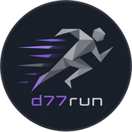

<p align="center"></p>

<h1 align="center">d77run</h1>

<p align="center">A small, fast "run dialog" — type a command or an app name, hit Enter, it runs.</p>

---

d77run is a from-scratch, modern rejuvenation of [gmrun](http://sourceforge.net/projects/gmrun):
the same idea — a tiny window, type to filter, Enter to launch, nothing else in your way — rebuilt
on GTK4 instead of gmrun's aging GTK2, with app icons that actually resolve correctly.

It's meant to be bound to a keyboard shortcut in your window manager/compositor (`Mod+R`, or
whatever you like), the same way you'd use `dmenu`, `rofi`, or `wofi` — not launched from a menu.

## Features

- **Type to filter** — searches your installed apps (`.desktop` entries) live as you type, showing
  each one's real icon next to its name, best matches first (exact match, then name-prefix match,
  then word-boundary match, then any other substring match).
- **Tab to complete** — completes to the top matching app name, or, if nothing matches an app,
  against `$PATH` executables and filesystem paths (absolute or `~/...`) instead. Single-match
  completions fill in outright; ambiguous ones fill in the longest common prefix *and* list every
  actual candidate below the entry (e.g. `xdg-us` → Tab lists `xdg-user-dir` and
  `xdg-user-dirs-update`), navigable with Up/Down — picking one only completes the text, it doesn't
  run anything by itself.
- **Enter to launch** — runs the selected app's real command, or, with nothing selected, whatever
  you typed as a raw shell command (`sh -c "..."`) — so it doubles as a quick command runner, not
  just an app launcher.
- **Up/Down** — moves the selection, or, once the list isn't showing matches, walks your command
  history — ordered by frecency (a frequency + recency blend, à la Firefox's URL bar) rather than
  strict most-recent-first, so a frequently-used command doesn't get buried by a single more recent
  one-off.
- **Escape** — quits without running anything.
- **Real icon resolution.** Every result shows the actual icon its `.desktop` entry points to,
  resolved through GTK4's own icon-theme lookup — the part of the original gmrun that never
  really worked.
- **Persistent history** — every command/app you launch is remembered
  (`$XDG_DATA_HOME/d77run/history`), for the frecency-ranked Up/Down recall above.

## Installing

<details>
<summary><b>Arch Linux</b></summary>

```sh
git clone https://github.com/dani-77/d77run.git
cd d77run
makepkg -si
```
</details>

<details>
<summary><b>Void Linux</b></summary>

```sh
git clone --depth 1 https://github.com/void-linux/void-packages.git
cd void-packages
./xbps-src binary-bootstrap
cp -r /path/to/d77run/void/srcpkgs/d77run srcpkgs/
./xbps-src pkg d77run
sudo xbps-install --repository=hostdir/binpkgs -R d77run
```

See [`void/README.md`](void/README.md) for more detail on this path.
</details>

<details>
<summary><b>Build from source (any distro)</b></summary>

Needs GTK4 development headers (`libgtk-4-dev` on Debian/Ubuntu, `gtk4-devel` on Fedora, `gtk4` on
Arch) and a Rust toolchain ([rustup.rs](https://rustup.rs) if you don't have one).

```sh
git clone https://github.com/dani-77/d77run.git
cd d77run
make
sudo make install PREFIX=/usr
```

To uninstall:

```sh
sudo make uninstall PREFIX=/usr
```
</details>

Any of the installation methods above (Arch package, Void package, or `make install`) automatically installs the binary, the `.desktop` entry (`assets/d77run.desktop`), and all icon sizes (`assets/d77run-icon.*`) into system icon themes, updating the system icon cache.

## Using it

Bind it to a key in your window manager/compositor config, the same way you would `rofi` or
`dmenu`. A couple of examples:

```lua
-- spitfire (~/.config/spitfire/config.lua)
spitfire.bind("Mod1", "r", function() spitfire.spawn("d77run") end)
```

```
# most other WMs: bind Mod+R (or whatever key) to the command
d77run
```

Once it's open: type to filter, `Tab` to complete, `↑`/`↓` to move through matches or history,
`Enter` to launch, `Esc` to quit.

## License

MIT — see [LICENSE](LICENSE). Original code, not derived from gmrun's GPL-licensed sources or from
[onagre](https://github.com/oknozor/onagre) (the project that used to live in this repository, now
at [dani-77/d77-launcher](https://github.com/dani-77/d77-launcher)).

Looking to build or contribute to d77run itself, rather than just use it? See
[`doc/README.md`](doc/README.md) for the status checklist and technical details.
